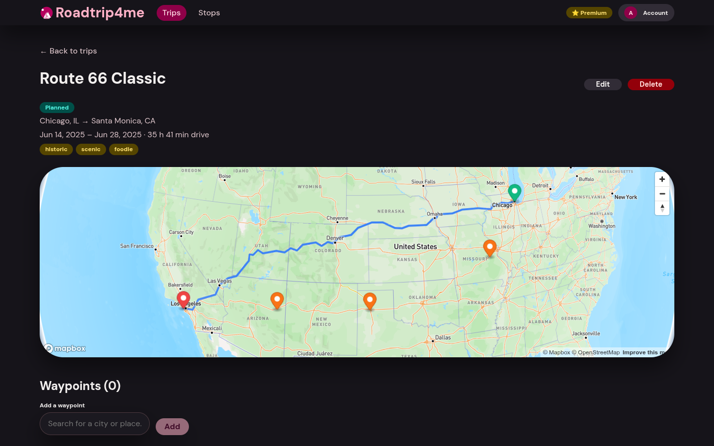
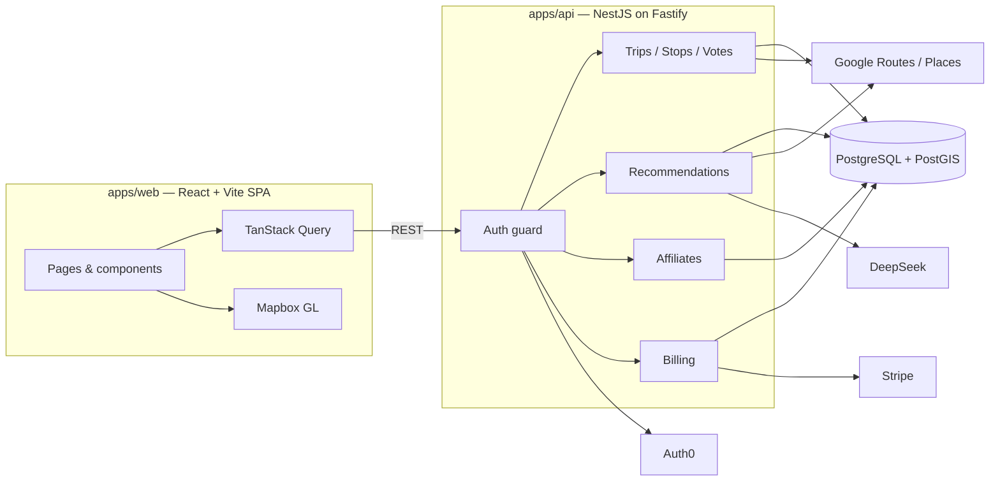

# Roadtrip4me 🚗

[](https://github.com/bmonagan/roadtrip4me/actions/workflows/ci.yml)
[](LICENSE)

AI-powered road-trip planner: build a route, discover community stops, get AI
stop recommendations, and find nearby stays — with optional Premium
subscriptions.

> **Portfolio project.** This app was built and run in production on Fly.io
> (see [`docs/deployment.md`](docs/deployment.md)); the hosting has since been
> decommissioned to keep it a showcase. It runs locally in **demo mode with no
> API keys required**.



## Features

- **Trip planner** — origin, destination, and waypoints rendered on a Mapbox
  map with the computed driving route and distance/duration.
- **Community stops** — browse, search, add, and vote on stops along a route.
- **AI recommendations** — LLM-suggested stops matched to trip "vibes" and
  preferences, with per-user daily budget enforcement.
- **Nearby stays** — hotel/activity/car cards from affiliate partners, with a
  deeplink fallback when live inventory isn't available.
- **Premium subscriptions** — Stripe checkout, webhook-driven entitlement, and
  a Premium-gated AI feature.
- **Auth** — Auth0 (Authorization Code + PKCE) with auto-provisioning, plus a
  dev fallback for local use.
- **Admin** — user management (grant/revoke premium & admin, delete users).

## Architecture



## Engineering highlights

A few decisions worth calling out (see [`docs/build-log.md`](docs/build-log.md)
for the full history):

- **No Redis / no separate queue.** All state and background work live in
  PostgreSQL; route computation and AI recommendations run as in-process
  `setImmediate` jobs with retry, in-flight dedupe, and stale-job recovery.
- **Cost-aware scale-to-zero.** The API and web machines scaled to zero when
  idle, and the database was downsized (and its volume shrunk 50 GB → 10 GB)
  after measuring actual usage.
- **Atomic budget enforcement.** The per-user daily AI limit is a single
  conditional `UPDATE` under a row lock, so concurrent requests can't exceed it.
- **Race-free writes.** Vote recalculations, trip/stop limits, and stop
  ordering use transactions with `SELECT … FOR UPDATE` to prevent lost updates
  and unique-constraint violations.
- **Opaque vs. JWT tokens.** Auth0 issues opaque access tokens by default; the
  API detects the format and validates JWTs against the tenant JWKS or opaque
  tokens against `/userinfo` (cached, with timeouts).
- **Typed end to end.** A single declaration-only `@roadtrip4me/types`
  workspace package is shared by both apps; the API's build reads the `.d.ts`.

## Tech stack

| Layer | Technology |
|---|---|
| Runtime | Bun |
| Frontend | React 18 · TypeScript · Vite · Mapbox GL JS · TanStack Query |
| Backend | NestJS · Fastify · TypeScript |
| Database | PostgreSQL 16 + PostGIS · Prisma ORM |
| Auth | Auth0 (Authorization Code + PKCE) |
| Payments | Stripe (Premium subscriptions) |
| Monorepo | Bun workspaces |

## Quick start (demo mode — no API keys)

```bash
bun install
cp apps/api/.env.example apps/api/.env
cp apps/web/.env.example apps/web/.env
docker compose up -d          # local PostgreSQL + PostGIS
bunx prisma migrate deploy    # apply migrations
bunx prisma db seed           # seed demo users, stops, and a Route 66 trip
bun run dev                   # web on :5173, API on :3000
```

The API examples ship with `DEMO_MODE=true` and `AUTH_DISABLED=true`, so:

- Google Routes/Places and DeepSeek are replaced with canned demo data;
- affiliate cards are placeholders;
- Stripe "upgrade" is simulated;
- `/login` lets you switch between the seeded identities (Alice/Bob).

Log in as **`alice@example.com`** (Premium + Admin) to see everything.

> **Map display:** the interactive Mapbox map needs a free `VITE_MAPBOX_TOKEN`
> in `apps/web/.env`. Without one, the app still runs and shows a placeholder
> in place of the map.

## Running with real integrations

Set `DEMO_MODE=false` and fill in the relevant variables in
`apps/api/.env` / `apps/web/.env`. The templates list every supported key:
Auth0 (`AUTH_DISABLED=false`), Google Maps, DeepSeek, Stripe, Booking.com,
Expedia, Stay22, and Travelpayouts. See
[`docs/deployment.md`](docs/deployment.md) for the production reference.

## Key commands

```bash
bun run dev        # both apps
bun run dev:web    # http://localhost:5173
bun run dev:api    # http://localhost:3000
bun run build      # build all apps
bun run typecheck  # type-check all packages
bun run lint       # ESLint both apps
bun run test       # Vitest (API + web)
bun run format     # Prettier
```

API health check: `curl http://localhost:3000/api/v1/health`

## Project structure

```
roadtrip4me/
├── apps/
│   ├── web/            React + Vite SPA
│   └── api/            NestJS backend
│       ├── prisma/     schema, migrations, seed
│       └── src/
│           ├── auth/ billing/ trips/ stops/ votes/
│           ├── recommendations/ affiliate/ maps/
│           └── demo/   DEMO_MODE fixtures + providers
├── packages/
│   └── types/          Shared TypeScript declarations
├── docs/               Architecture, deployment, screenshots
├── docker-compose.yml  Local Postgres (PostGIS)
└── .github/workflows/  CI (typecheck, lint, test, build, secret scan)
```

## License

[MIT](LICENSE)
